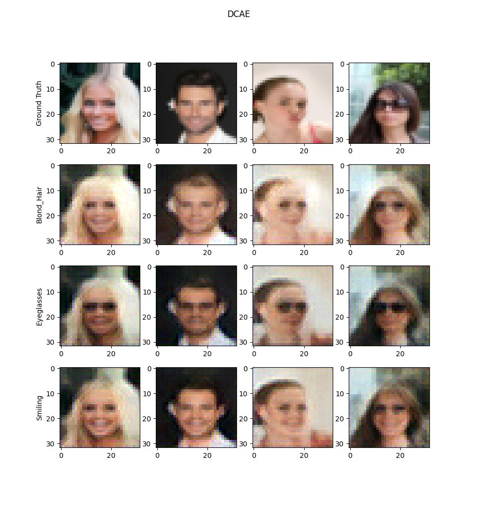

# Hi There !
I'm Célian Raimbault, a french IT student and hobbyist.

Currently studying at [EPITA](https://github.com/epita), I spend a lot of time coding some AIs, OSes and much more 😄

## I like coding...
### Deep Learning algorithms

### Operating Systems

### Mobile Apps
Available on the [Play Store](https://play.google.com/store/apps/details?id=com.cc.quick_shop) !

<!-- TODO : https://github.com/Cc618/Up-Lang -->
<!-- TODO : Add link -->

## Some stats

## Contact

<a href=https://www.linkedin.com/in/c%C3%A9lian-raimbault-53269a1b2> LinkedIn</a>

 celian.dev@gmail.com
