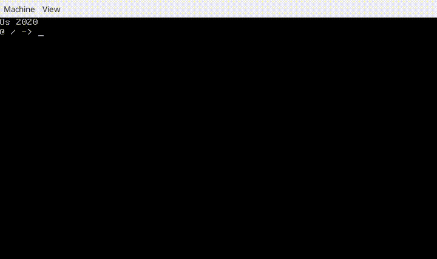

# Hi There !
I'm Célian Raimbault, a french IT student and hobbyist 😄

## I like coding...
### Deep Learning algorithms

### Operating Systems

### Mobile Apps

[Play Store page](https://play.google.com/store/apps/details?id=com.cc.quick_shop)

<!-- TODO : https://github.com/Cc618/Up-Lang -->
<!-- TODO : Add link -->

## Some stats

