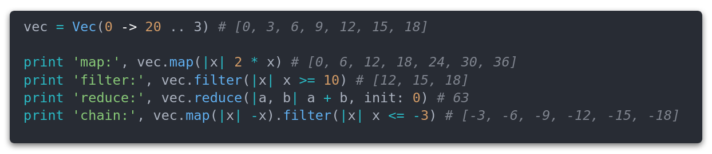
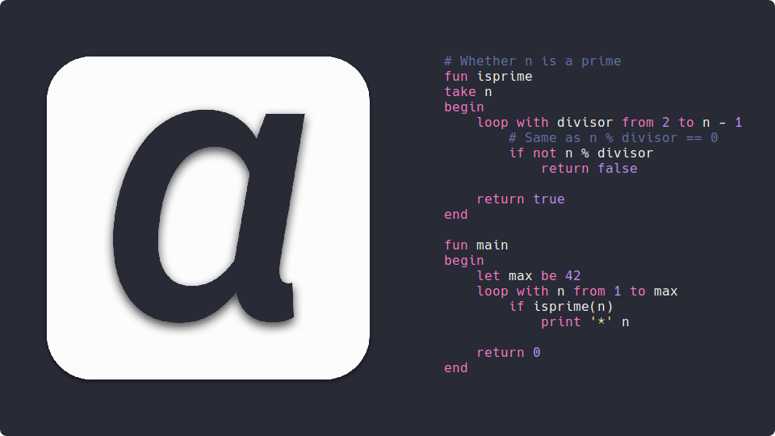
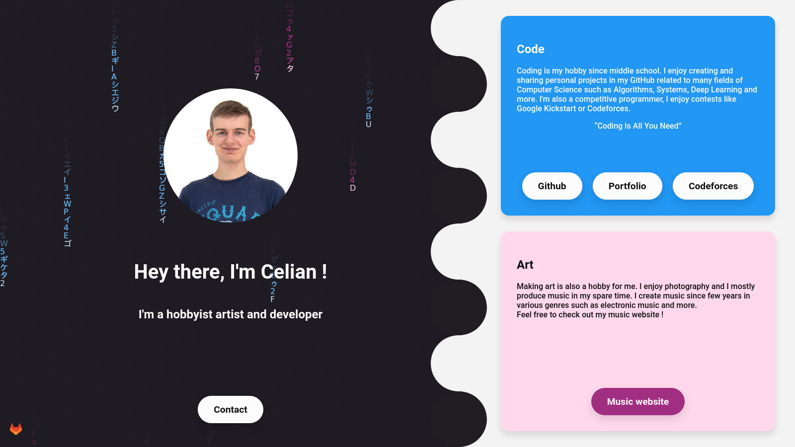

# Hi There !
I'm Célian Raimbault, a French IT professional and hobbyist.

I spend a lot of time coding some AIs, OSes and much more 😄
Competitive programming is also one of my hobbies, I organize and participate regularly to several coding competitions such as [CodeForces](https://codeforces.com/profile/Cc618).

Take a look at my [website](https://celian.dev) or my [portfolio](https://portfolio.celian.dev) !

## I like coding...
### Deep Learning algorithms

A collection of deep learning algorithms made with PyTorch. Inspired by several research papers, it includes mostly image processing and reinforcement learning algorithms.

Convolutional autoencoder able to change image attributes. It can modify hair color, add glasses and more.

### Operating Systems

32 bits Operating System. Written in C and assembly, it provides a custom bootloader, a libc and a Fat32 file system driver.

### Programming Languages
<a href="https://github.com/Cc618/Riddim">

</a>
Interpreted language made in C++ designed for algorithms / data structures.
It contains a garbage collector, a standard library, an auto documentation generator and more.

 
 

Compiled programming language made entirely in Julia. It contains also a Lexer and Parser generator like Flex and Bison and a Vim plugin.

### Mobile Apps
Available on the [Play Store](https://play.google.com/store/apps/details?id=com.cc.quick_shop) !

Shopping list mobile application. Produced with the Flutter framework in Dart.

### Websites

My set of websites [celian.dev](https://celian.dev).

## Some stats

<!--  -->

## Contact
<a href="https://www.linkedin.com/in/celian-raimbault"> LinkedIn</a>

 [Professional](mailto:celian.pro.78@gmail.com "celian.pro.78@gmail.com") - [Development](mailto:celian.dev@gmail.com "celian.dev@gmail.com")

[My CV](https://cv.celian.dev)

<a href="https://gitlab.com/Cc618"> Gitlab</a>

> All other contacts can be found on my [contact page](https://contact.celian.dev)
